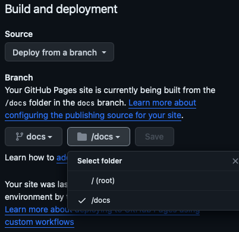

# Swift-DocC Template

Use Swift-DocC to build and share documentation for most any software code project.  You can build documentation as a Swift-DocC article or sample code, even if it is not Swift code.  

## Overview

Use this starter template to create rich documentation and interactive tutorials for *non* Swift projects.  For example, you can write an article on the development of creating web maps that is heavy with GeoJSON, JSON, or TypeScript.  See the section [Add Code Listings][Add Code Listings] for the programming languages where you can enable syntax highlighting.

You can edit with Xcode 15 and its Documentation Preview assistant editor, which gives you a view of your documentation as you type, allowing you to iterate on your documentation without leaving the Xcode.  Or, you can use your favorite editor and generate documentation from a [Swift based command line][Swift based command line].  The generated Swift-DocC documentation can be published to a static web host.

The template makes use of the [Swift Package Manager command plugin for Swift-DocC][Swift Package Manager command plugin for Swift-DocC], which has the [Swift-DocC documentation site][Swift-DocC documentation site].

[Swift based command line]: https://www.swift.org/install "Swift development is officially supported on Apple platforms, Linux, and Windows."
[Add Code Listings]: https://www.swift.org/documentation/docc/formatting-your-documentation-content#Add-Code-Listings "code listings, or fenced code blocks"
[Swift Package Manager command plugin for Swift-DocC]: https://github.com/apple/swift-docc-plugin "The Swift-DocC plugin is a Swift Package Manager command plugin that supports building documentation for SwiftPM libraries and executables."
[Swift-DocC documentation site]: https://apple.github.io/swift-docc-plugin/documentation/swiftdoccplugin "Swift-DocC documentation for the plugin."
[pre-built Swift-DocC web renderer]: https://github.com/apple/swift-docc-render-artifact "Pre-built copy of the web renderer for Swift-DocC documentation."

### Test

Run & build using the DocC command of your choice (either from Xcode or a Swift Docker Container).  The name of the root documentation is called `docctemplate` at the top level header.  

* <http://server:4256/documentation/docctemplate>

This name matches in both `Documentation.docc/Documentation.md` and the minimal symbols JSON file `Documentation.docc/DocC.symbols.json`.  When you want to change the name, be sure to change `docctemplate` in both files.

`Documentation.md` in the top level header, found on line 1.

```markdown
# ``docctemplate``
```

`DocC.symbols.json` in the `module` key.

```json
  "module": {
    "name": "docctemplate",
    ...
  }
```

## Topics

* [Meet DocC documentation in Xcode](https://developer.apple.com/videos/play/wwdc2021/10166 "site: developer.apple.com")
  * [Xcode 15's Documentation Preview assistant editor](https://developer.apple.com/videos/play/wwdc2023/10244/?time=485 "Video demo of Documentation Preview at developer.apple.com")
  * [Search Swift-DocC Videos at developer.apple.com](https://developer.apple.com/search/?q=docc&type=Videos "Search Swift-DocC Videos at Apple")
    * [Create rich documentation with Swift-DocC](https://developer.apple.com/wwdc23/10244 "Swift-Doc video at developer.apple.com")
* [Produce rich API reference documentation and interactive tutorials site](https://www.swift.org/documentation/docc "swift.org version of Swift-DocC")
* For examples of Swift-DocC tutorials, see <https://developer.apple.com/tutorials>
  * [Introducing SwiftUI](https://developer.apple.com/tutorials/SwiftUI "SwiftUI Tutorials at developer.apple.com")
  * [Bring an iPad App to the Mac with Mac Catalyst](https://developer.apple.com/tutorials/Mac-Catalyst "Mac Catalyst Tutorials at developer.apple.com")

---

## Command Line

### Xcode

Open via the Xcode text editor invocation tool.

```console
xed Package.swift
```

Preview documentation from a source bundle.

```console
# xcrun docc preview -h
#    Port number to use for the preview web server.
xcrun docc preview Documentation.docc --port 4256 --output-path tmp/dist
```

### DocC with Docker

Swift-DocC is integrated with the Swift toolchain since Swift 5.6.

With Docker, consider using `docc convert` instead of `docc preview`, and then plan on using your own web server.

To install Swift Docker see:  <https://www.swift.org/install/linux/#installation-via-docker>

```console
# docker pull swift
docker run --rm --privileged --interactive --tty \
  --volume $(pwd):/home                          \
  --name swift-latest swift:latest /bin/bash
```

```console
# within Docker be sure to `cd home` to access the local volume
cd home
# make a temporary directory output
mkdir tmp
```

### Staging

Convert documentation from a source bundle

* Set a test output folder
* serve that folder for testing
* Do not commit to GH Pages, as the `baseUrl` is set for local testing.

```console
# docc -h
# docc convert -h
docc convert Documentation.docc --output-path tmp/distFromDocker
```

### Production

Convert documentation from a source bundle, and prepare for hosting on GH Pages

Since we used the switch `--hosting-base-path docs`, then this is the version that would be posted to GitHub Pages and assumes that the root is `/docs`.

* Set the producttion output folder
* you will not be able to serve that folder for testing
* This can be committed to GH Pages, as the `baseUrl` is set for production


```console
docc convert Documentation.docc --output-path docs --hosting-base-path <nameOfYourGHRepoName>
```

### GitHub Settings for DocC

* Output the generated HTML to `<repo_root>/docs` on the local drive
* Set the branch to `docs` and serve from GH Pages the folder within the branch called `/docs`
* See the `docc` help for `--hosting-base-path`
  * `docc convert -h`



### Swift Command Line

For example, you can use these command directly in macOS or from your Docker container.

Resolve package dependencies.

```console
# Optionally `clean`
# rm -rf .build .swiftpm Documentation.docc/.docc-build

# swift package resolve -h
swift package resolve
```

Artifact management via `swift package clean | reset`.

```console
# Online help
swift package

# SUBCOMMANDS:
#  clean                   Delete build artifacts
#  reset                   Reset the complete cache/build directory
```

Display available options.

```console
swift -help
```

### Swift Versions  

Print Swift version information and exit.

```console
swift -version
```

#### macOS Big Sur (11.7.10) 🔴

Swift 5.6 is required in order to run the [Swift Package Manager command plugin for Swift-DocC][Swift Package Manager command plugin for Swift-DocC].  Use Docker if you need DocC on macOS Big Sur.

    swift-driver version: 1.26.21 Apple Swift version 5.5.2 (swiftlang-1300.0.47.5 clang-1300.0.29.30)
    Target: x86_64-apple-macosx11.0

#### macOS Sonoma (14)

    swift-driver version: 1.87.1 Apple Swift version 5.9 (swiftlang-5.9.0.128.108 clang-1500.0.40.1)
    Target: x86_64-apple-macosx14.0

#### Docker `swift:latest`

    Swift version 5.9 (swift-5.9-RELEASE)
    Target: x86_64-unknown-linux-gnu

---

*Customization example with `@Metadata` directives.*

