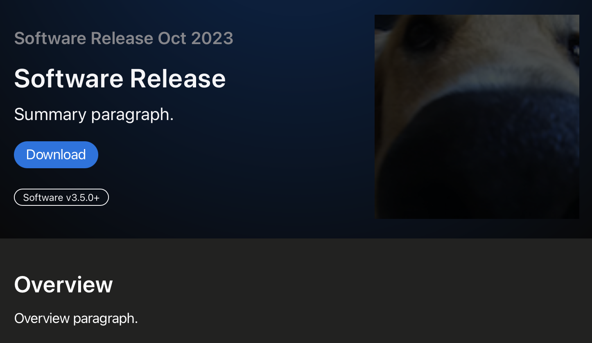

# Swift-DocC Template

Use Swift-DocC to build and share documentation for most any software code project.  You can build documentation as a Swift-DocC article or sample code, even if it is not Swift code.  

## Overview

Use this starter template to create rich documentation and interactive tutorials for *non* Swift projects.  For example, you can write an article on the development of creating web maps that is heavy with GeoJSON, JSON, or TypeScript.  See the section [Add Code Listings][Add Code Listings] for the programming languages where you can enable syntax highlighting.

You can edit with Xcode 15 and its Documentation Preview assistant editor, which gives you a view of your documentation as you type, allowing you to iterate on your documentation without leaving the Xcode.  Or, you can use your favorite editor and generate documentation from a [Swift based command line][Swift based command line].  The generated Swift-DocC documentation can be published to a static web host.

The template makes use of the [Swift Package Manager command plugin for Swift-DocC][Swift Package Manager command plugin for Swift-DocC], which has the [Swift-DocC documentation site][Swift-DocC documentation site].

[Swift based command line]: https://www.swift.org/install "Swift development is officially supported on Apple platforms, Linux, and Windows."
[Add Code Listings]: https://www.swift.org/documentation/docc/formatting-your-documentation-content#Add-Code-Listings "code listings, or fenced code blocks"
[Swift Package Manager command plugin for Swift-DocC]: https://github.com/apple/swift-docc-plugin "The Swift-DocC plugin is a Swift Package Manager command plugin that supports building documentation for SwiftPM libraries and executables."
[Swift-DocC documentation site]: https://apple.github.io/swift-docc-plugin/documentation/swiftdoccplugin "Swift-DocC documentation for the plugin."

## Topics

* [Meet DocC documentation in Xcode](https://developer.apple.com/videos/play/wwdc2021/10166 "site: developer.apple.com")
  * [Xcode 15's Documentation Preview assistant editor](https://developer.apple.com/videos/play/wwdc2023/10244/?time=485 "Video demo of Documentation Preview at developer.apple.com")
  * [Search Swift-DocC Videos at developer.apple.com](https://developer.apple.com/search/?q=docc&type=Videos "Search Swift-DocC Videos at Apple")
    * [Create rich documentation with Swift-DocC](https://developer.apple.com/wwdc23/10244 "Swift-Doc video at developer.apple.com")
* [Produce rich API reference documentation and interactive tutorials site](https://www.swift.org/documentation/docc "swift.org version of Swift-DocC")
* For examples of Swift-DocC tutorials, see <https://developer.apple.com/tutorials>
  * [Introducing SwiftUI](https://developer.apple.com/tutorials/SwiftUI "SwiftUI Tutorials at developer.apple.com")
  * [Bring an iPad App to the Mac with Mac Catalyst](https://developer.apple.com/tutorials/Mac-Catalyst "Mac Catalyst Tutorials at developer.apple.com")

---

## Command Line

### Xcode

Preview documentation from a source bundle.

```console
# xcrun docc preview -h
#    Port number to use for the preview web server.
xcrun docc preview Documentation.docc --port 4256
```

### Swift Command Line

Resolve package dependencies.

```console
# swift package resolve -h
swift package resolve
```

Artifact management via `swift package clean | reset`.

```console
# Online help
swift package

# SUBCOMMANDS:
#  clean                   Delete build artifacts
#  reset                   Reset the complete cache/build directory
```

Print Swift version information and exit.

```console
swift -version
```

```console
swift -help
```

---

*Customization example with `@Metadata` directives.*

